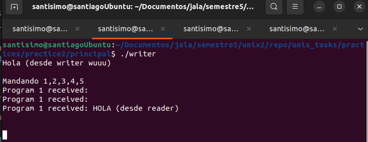
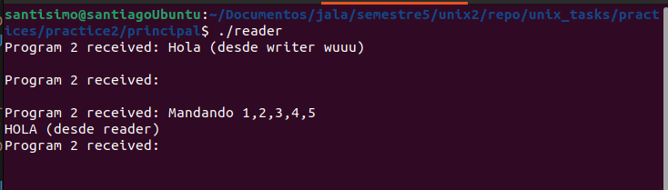

# unix_tasks
Unix tasks and finalProject

## Santiago Caballero Manzaneda 

---

## Practice 

## Comunicación entre dos programas usando tuberías con nombre

### Descripción

1. Crear dos programas (sin usar `fork`).
2. Comunicarse entre los dos programas a través de tuberías con nombre.
3. Leer desde `stdin` en cada programa y escribir en la tubería con nombre.
4. Leer desde la tubería con nombre en cada programa y escribir en `stdout`.

### Consejos

- Uno de los programas necesita leer primero y el otro necesita escribir primero.
- Puedes usar la función `fgets()` para leer desde `stdin` y almacenar en un array `char[]` temporal.
- Puedes usar un tamaño estático de mensajes de 128 caracteres, por ejemplo.

### Firmas de la función `mmap`

```c
void *mmap(void *addr, size_t length, int prot, int flags, int fd, off_t offset);

```

### Practica Terminada:

[Practice 2](practices/practice2/principal)

- *Before* create the pipes with mkfifo
```
mkfifo pipe1
mkfifo pipe2
```

- To run, inside the practice run in 2 different terminals:
- Terminal 1:
```
./writer
```

- Terminal 2:
```
./reader
```
- then send a message from writer
- Press enter
- VERIFY the terminal 2 from reader
- Proofs below
---

** Terminado, pruebas adjuntas **





---
