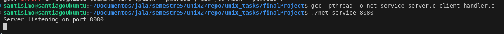
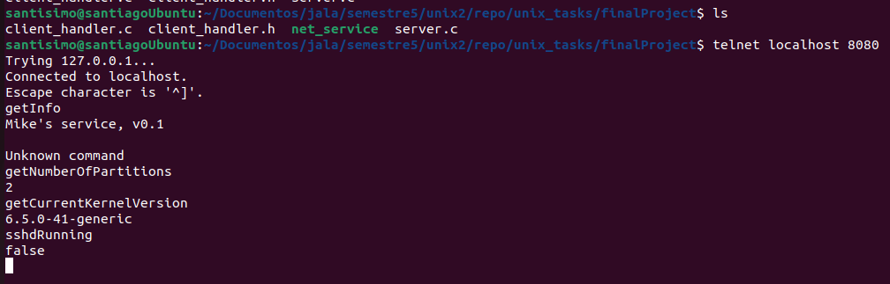

# unix_tasks
Unix tasks and finalProject

## Santiago Caballero Manzaneda 

---

## Practice 

## Comunicación entre dos programas usando tuberías con nombre

### Descripción

1. Crear dos programas (sin usar `fork`).
2. Comunicarse entre los dos programas a través de tuberías con nombre.
3. Leer desde `stdin` en cada programa y escribir en la tubería con nombre.
4. Leer desde la tubería con nombre en cada programa y escribir en `stdout`.

### Consejos

- Uno de los programas necesita leer primero y el otro necesita escribir primero.
- Puedes usar la función `fgets()` para leer desde `stdin` y almacenar en un array `char[]` temporal.
- Puedes usar un tamaño estático de mensajes de 128 caracteres, por ejemplo.

### Firmas de la función `mmap`

```c
void *mmap(void *addr, size_t length, int prot, int flags, int fd, off_t offset);

```

### Practica Terminada:

[Practice 2](practices/practice2/principal)

- *Before* create the pipes with mkfifo
```
mkfifo pipe1
mkfifo pipe2
```

- To run, inside the practice run in 2 different terminals:
- Terminal 1:
```
./writer
```

- Terminal 2:
```
./reader
```
- then send a message from writer
- Press enter
- VERIFY the terminal 2 from reader
- Proofs below
---

** Terminado, pruebas adjuntas **


---


# Final Project

## *Service Running a NET Socket*

## Description

This service will run a NET socket with the following specifications:

- Maximum connections: 30
- The port will be received as a program argument.
- Every client connection will be handled by a thread or fork.
- The service will handle the `SIGINT` signal (Ctrl+C).

### Messages Handled by the Service

1. **getInfo**: Returns the service name and version, e.g., "Mike’s service, v0.1".
2. **getNumberOfPartitions**: Returns the number of partitions of the system.
   - Can be implemented using bash scripting or calling directly to utilities, e.g., `lsblk -l | grep part`.
3. **getCurrentKernelVersion**: Returns the kernel version that the system is running (just the numerical part).
   - Can be implemented using `uname -r`, either through bash scripting or by calling the `uname` utility directly.
4. **sshdRunning**: Returns `true` or `false` indicating if `sshd` is running.
   - Should be implemented using `popen()`.
   - Can use methods like `ps ax|grep sshd`, `netstat -l |grep ssh`, or verifying that `sshd.pid` file exists (`/var/run/sshd.pid`).

### Implementation Details

- For `getInfo`, `getNumberOfPartitions`, and `getCurrentKernelVersion`, two of them can be implemented with bash scripting, and the third one needs to be with `popen` or `execv` (or variations) if applicable.


---

### Project Completed:

Follow this steps to test the project:

- In the terminal of the project route run:  gcc -phtread -o net_service server.c client_handler.c
- Run the server in the port you prefer, in my case: 8080: ./net_service 8080

- **To test the server you can use telnet**
- In other terminal run: telnet localhost 8080
- try running the methods:
```
$ telnet localhost 8080
Trying 127.0.0.1...
Connected to localhost.
Escape character is '^]'.
getInfo
Mike's service, v0.1
getNumberOfPartitions
2
getCurrentKernelVersion
6.5.0-41-generic

sshdRunning
false
```

**Proofs:**



